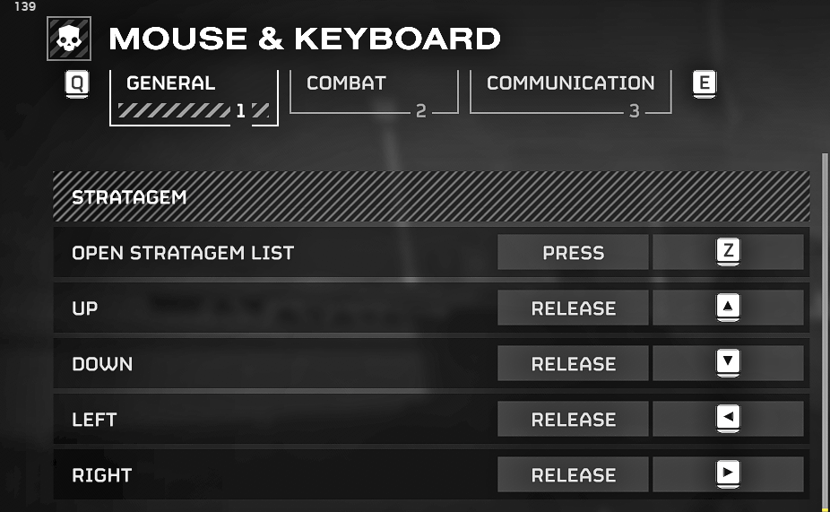

# Helldivers 2 Farming Guide by Igromanru

**The guide revolves around the abridged version of the released ED CT, compiled by me for farming**  
You need the "Farming" Cheat Engine Table from the [release](https://github.com/igromanru/HD2-Farming-Guide/releases) to follow the guide!
Which is an abridge version of the Experimental Division CT v4.0.0 (credits Zodiac, Havoc and anyone else who provided scripts for it).  
The Farming CT contains only features that you need to farm Super Credits, Samples, Medals and Experience.  

## Index
- [Required resources](#required-resources)
- [Required first steps for each farming session](#required-first-steps-for-each-farming-session)
- [Super Credits Farming](#super-credits-farming)
  - [Configurations](#configurations)
    - [AutoIt script](#autoit-script)
    - [Mass SC Packs Drop](#mass-sc-packs-drop)
- [Medals and Experience Farming](#medals-and-experience-farming)
- [Samples Farming](#samples-farming)
- [FAQ](#faq)
  - [Which kind of cheats are possible in the game?](#which-kind-of-cheats-are-possible-in-the-game)
  - [Super Credits / Medals limit per mission](#super-credits--medals-limit-per-mission)
  - [Game Crashes](#game-crashes)
  - [AntiCheat Details](#anticheat-details)
- [Related Discord Server](#related-discord-server)

## Required resources
- Basic understanding of how Cheat Engine works (watch video tutorials on YT)
- [Cheat Engine 7.5](https://mega.nz/file/HNFRBSrY#rj4oel3UuK9hoj1BtezRVbGhNJBo8mQ3EYl7ioFprcc) or higher
- **GameGuard Bypass**
- [HD2 ED Farming table](https://github.com/igromanru/HD2-Farming-Guide/releases)
- [My AutoIt PickUp Macro](https://github.com/igromanru/HD2-Farming-Guide/releases) or similar
- Installed [AutoIt](https://www.autoitscript.com/site/autoit/downloads/) (if you want to use the script)
- Understanding on how the game works

## Required first steps for each farming session
Steps that you need to do each time, no matter what you want to farm.
1. Start the game and use a third-party GameGuard Bypass, that you have to get somewhere first, to remove the Anti-Cheat from the game.  
3. Open the Farming CT in Cheat Engine. Usually you can simple double-click on the CT to open in directly with CE.
7. Activate the initializer script **ED Farming Only v(version number here)**
8. Enable the **Enable All Universal features** group header to activate all the scripts inside the group

## Super Credits Farming
**Important:**
- Read [AutoIt script and Game configurations](#autoit-script-and-game-configurations) below, to learn how to set-up the script and/or change your in-game hotkeys.  
- Use `Borderless Window` or `Window` as **Display Mode**. Don't use "Fullscreen"!

1. Follow [Required first steps for each farming session](#required-first-steps-for-each-farming-session)
2. Activate the **Enable All features for Super Credits Farming** group header to enable all SC relevant features
3. Execute the AutoIt script **SC-Farming-Macro.au3** (just double-click the file, if AutoIt is installed)
4. Start a **Terminids**, **Difficulty 4**, **40 min** mission.  
5. On the Loadout screen, select the **Orbital Precision Strike** Stratagem. (It's the first Stratagem in the first row)
6. Drop into the mission and lay down on a flat surface.  
7. Press **F3** (default hotkey) to start the AutoIt macro, which will drop automatically 13 SC for you, pick them up and repeat the process.  
By default, it runs 60 times with 13 SC per pick-up loop (780 overall). The duration is about 60 minutes, and you shouldn't use your PC while it’s running.  
**Attention!** The macro uses **E** key for interaction, **Z** to toggle the Stratagems List menu and arrow keys for the input. If you use different keys, read the [AutoIt script and Game configurations](#autoit-script-and-game-configurations) section!
1. Wait until the macro is done. It will show a Message Box with the message: *SC Farming loop finished*
2. Use the **Kill HD2 & CE** script to terminate the game’s process and close Cheat Engine if it gets stuck.

**Important Notes**
- You can figure out how many pickup loops you can do before the game crashes, change the macro script to the maximum value, and switch the planet to continue farming after each full farming loop. It should extend the farming session before you have to restart the game.
- In the latest version, the AutoIt script will show at which loop the game crashed, if it happens. It can be used to determine the limit.
- If you want to extract, you have to disable **Enable All features for Super Credits Farming** group before completing the mission!  
- The AutoIt script runs in the background. To exit it, right-click the AutoIt tray icon in the taskbar and select **Exit** or press **F10**

### AutoIt script and Game configurations
**Important:** The Macro simulates key inputs, therefore they must match your in-game hotkey configurations.  

#### AutoIt script settings
You can configure the AutoIt Macro to your liking, to change hotkeys or reduce or increase how many "pick-up loops" it will run.  
Open **SC-Farming-Macro.au3** in any text editor, but preferably in AutoIt's own editor, SciTE.  
[Here](https://www.autoitscript.com/autoit3/docs/functions/Send.htm) you can find a documentation on AutoIt keys. It applies to hotkeys as well.  

**Changeable variables in script:**  
`$iPickUpsCount` is the number of "pick-up loops" the script will run. Each loop collects 13 SC and then waits for the server’s cooldown (46 sec) before continuing. The number of loops basically determines how long the macro will run. (Default: 60)   
`$sInteractionKey` is the interaction key for picking up items. The default is `E`. If you have changed it in the game, you must change it here as well.  
`$sMacroHotKey` is the hotkey to start the macro. The default is `F3`.  
`$sMacroCancelHotKey` is the hotkey to cancel the macro. The default is `F4`. You can interrupt the macro at any time with this hotkey.  
`$sExitScriptHotKey` is the hotkey to exit the whole script. Default key: `F10`.  
`$sOpenStratagemListKey` is the key that toggle opens the **Stratagem List** menu, in-game you must set it to **Press**. Default and recommended key: `Z`.  
`$UP`, `$DOWN`, `$LEFT` and `$RIGHT` are input keys for Stratagems. I highly recommend changing them to the arrow keys in your game. It will allow you to call Stratagems while you're moving. The default keys are the **arrow keys**: `up`, `down`, `left`, and `right`.

#### In-game settings
Most important change that you have to make in the game settings is to change the **Open Stratagem List** setting to **Press** and assign some convenient key like `Z`.  
Change the input method of Up, Down, Left and Right to **Release**!  
The keys you use can be adjusted in the AutoIt script (see above), but I highly recommend using the **arrow keys** for Stratagem input, as it will improve your overall gameplay.  
  

## Medals and Experience Farming
Can be combined with [Samples Farming](#samples-farming)

1. Follow [Required first steps for each farming session](#required-first-steps-for-each-farming-session)
2. Activate the **Enable All features for Medals and Experience farming** group header to enable all relevant features
3. Start any mission
4. After landing, use hotkey **I** to activate the feature of the `Instant Complete Mission` script
5. Extract
6. Repeat from **step 3.** for more Medals and Exp

## Samples Farming
Can be combined with [Medals and Experience Farming](#medals-and-experience-farming).  

1. Follow [Required first steps for each farming session](#required-first-steps-for-each-farming-session)
2. Activate the **Enable All features for Samples farming** group header to enable all relevant features
3. Start any mission
4. After landing, use hotkey **I** to activate the feature of the `Instant Complete Mission` script
5. Extract. You will get 100 of each Sample.
6. Repeat from **step 3.** for more Samples

## FAQ
### Which kind of cheats are possible in the game?
In HD2, most gameplay mechanics are handled by the client, and the host of a match is acting as a game server. That's why so many things are possible, from Infinite Health to changing weapon projects or replacing stratagems.  
However, all currencies and players progression are saved on central servers, therefore they can't be directly influenced.  
For that reason we have to farm all the currencies, experience, and samples and can't just change the value, or change the price of Warbonds, Stratagems, etc.  

### Super Credits / Medals limit per mission
Originally, there’s a limit on how many Super Credit or Medal stacks can be picked up in a mission. You should count in stacks, one stack equals one pick-up. The server determines how many resources you get from each stack. One Super Credit stack usually gives you 10 SC, with a 1% chance to get 100 instead. For Medals, the amount is random.  
The original limit is random between 0 and 15. The limit applies to each player individually.  

**Remove Currency Pickup Limit script**  
The feature allows bypassing the original limit.  
With the feature enabled, you can pick up exactly 13 stacks every ~45 seconds.
It’s the server’s cooldown, and there’s currently no known way to skip it.  
If the host of the lobby uses the script, the limit will be bypassed for all players. But they won’t be able to see the pick-up notification. Also, you should make sure that nobody picks up SC or Medals during the 45s cooldown. 
### Super Credits appear as question "?" mark
It means the SC model isn’t loaded in the current mission.  
You can either switch to another mission or install the [Super Credits Cheat Arrows](https://mods.rpghq.org/Helldivers%202/176522) mod, which forces the game to always load the model.  
Use the [HD2 Arsenal – Mod Manager](https://www.nexusmods.com/helldivers2/mods/4664) to manage your mods — it’s better than other HD2 mod managers.
### Cheat Engine closes after attaching to the process
It's an issue in CE v7.5. You can fix it easily.  
1. Open Cheat Engine (doesn't matter if with a CT or not)
2. In context menu at the top, select **Edit**->**Settings**
3. In CE settings open the **Debugging Options** tab
4. Enable the checkbox `Do not load external debug symbols like .PDB/.DBG files (Breaks tables that use these symbols)`
5. Press **OK** at the bottom to save the settings
6. Done

### Game Crashes
Hacking is not an "exact science". Removing GameGuard from the game will sometimes cause it to crash. Also, some features might cause crashes under different circumstances.  
To reduce any friction, read the guide carefully and follow the steps.  

### AntiCheat Details
**nProtect GameGuard in Helldivers 2** serves solely as anti-tamper software. Despite what it can do in other games, in HD2 it only attempts to preserve the integrity of the original code and prevent external software from accessing the process. It doesn't even check for foreign DLLs in the process.
If GameGuard detects ".text" code changes or one of the blacklisted programs like Cheat Engine, it will only close the game, usually with a message.    
There are no (GameGuard) bans! And until today, no bans for cheating were reported in any of HD2 related (cheating) communities.

## Discord Server
Don't join if you haven't read the guide. People who refuse to read but still ask for help aren’t welcome!  
  
*GameGuard Bypass is available on Discord for selected members.*