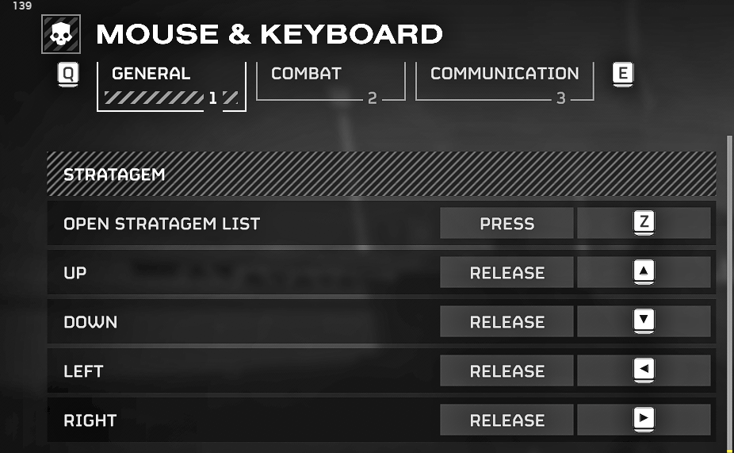

# Руководство по фарму в Helldivers 2 от Igromanru

**Руководство основано на сокращенной версии ED CT, подготовленной мной специально для фарма-**  
Чтобы следовать этому руководству, вам нужна "Farming" Cheat Engine Table из [релиза](https://github.com/igromanru/HD2-Farming-Guide/releases)!  
Это урезанная версия Experimental Division CT v4.0.0 (спасибо Zodiac, Havoc предоставлял для нее скрипты).  
Farming CT содержит только те функции, которые нужны для фарма Super Credits, Samples, Medals и Experience.

## Содержание
- [Необходимые ресурсы](#required-resources)
- [Обязательные первые шаги для каждой сессии фарма](#required-first-steps-for-each-farming-session)
- [Фарм Super Credits](#super-credits-farming)
  - [Конфигурации](#configurations)
    - [AutoIt скрипт](#autoit-script)
    - [Массовый дроп SC паков](#mass-sc-packs-drop)
- [Фарм Medals и Experience](#medals-and-experience-farming)
- [Фарм Samples](#samples-farming)
- [FAQ](#faq)
  - [Какие виды читов возможны в игре?](#which-kind-of-cheats-are-possible-in-the-game)
  - [Лимит Super Credits / Medals за миссию](#super-credits--medals-limit-per-mission)
  - [Краши игры](#game-crashes)
  - [Детали AntiCheat](#anticheat-details)
- [Discord сервер](#related-discord-server)

## Необходимые ресурсы
- Базовое понимание того, как работает Cheat Engine (посмотрите видеоуроки на YouTube)
- [Cheat Engine 7.5](https://mega.nz/file/HNFRBSrY#rj4oel3UuK9hoj1BtezRVbGhNJBo8mQ3EYl7ioFprcc) или новее
- **GameGuard Bypass**
- [HD2 ED Farming table](https://github.com/igromanru/HD2-Farming-Guide/releases)
- [Мой AutoIt PickUp Macro](https://github.com/igromanru/HD2-Farming-Guide/releases) или аналог
- Установленный [AutoIt](https://www.autoitscript.com/site/autoit/downloads/) (если вы хотите использовать скрипт)
- Понимание того, как работает игра

## Обязательные первые шаги для каждой сессии фарма
Шаги, которые нужно выполнять каждый раз, независимо от того, что именно вы хотите фармить.

1. Запустите игру и используйте сторонний GameGuard Bypass, который нужно где-то заранее получить, чтобы отключить Anti-Cheat.  
2. Откройте Farming CT в Cheat Engine. Обычно можно просто дважды кликнуть по CT, чтобы открыть его напрямую через CE.  
3. Активируйте инициализирующий скрипт **ED Farming Only v(номер версии здесь)**  
4. Включите группу **Enable All Universal features** (это активирует все универсальные скрипты внутри)

## Фарм Super Credits
**Важно:**
- Прочитайте раздел [AutoIt скрипт и конфигурации игры](#autoit-script-and-game-configurations) ниже, чтобы узнать, как настроить скрипт и/или изменить ваши игровые горячие клавиши.  
- Используйте `Borderless Window` или `Window` как **Display Mode**. Не используйте "Fullscreen"!

1. Выполните [Обязательные первые шаги для каждой сессии фарма](#required-first-steps-for-each-farming-session)
2. Активируйте заголовок группы **Enable All features for Super Credits Farming**, чтобы включить все функции, связанные с SC
3. Запустите AutoIt скрипт **SC-Farming-Macro.au3** (просто дважды кликните файл, если AutoIt установлен)
4. Начните миссию **Terminids**, **Difficulty 4**, **40 min**  
5. На экране Loadout выберите стратагему **Orbital Precision Strike** (это первая стратагема в первой строке)
6. Высадитесь в миссию и лягте на ровную поверхность  
7. Нажмите **F3** (горячая клавиша по умолчанию), чтобы запустить AutoIt макрос. Он автоматически будет сбрасывать 9 SC, подбирать их и повторять процесс.  

По умолчанию он выполняется 100 раз по 9 SC за цикл подбора (900 всего). Длительность около 100 минут, и во время выполнения не стоит использовать компьютер.  

**Внимание!** Макрос использует клавишу **E** для взаимодействия, **Z** для открытия меню Stratagems и стрелки для ввода. Если у вас другие клавиши, прочитайте раздел [AutoIt скрипт и конфигурации игры](#autoit-script-and-game-configurations)!

1. Дождитесь завершения макроса. Появится Message Box с сообщением: *SC Farming loop finished*
2. Используйте скрипт **Kill HD2 & CE**, чтобы завершить процесс игры и закрыть Cheat Engine, если он зависнет.

**Важные заметки**
- Вы можете определить, сколько циклов подбора можно выполнить до краша игры, изменить макрос на максимальное значение и менять планету после каждого полного цикла фарма. Это позволит дольше фармить без перезапуска игры.
- В последней версии AutoIt скрипт покажет, на каком цикле игра крашнулась, если это произойдет. Это можно использовать для определения лимита.
- Если вы хотите эвакуироваться, нужно отключить **Enable All features for Super Credits Farming** перед завершением миссии!  
- AutoIt скрипт работает в фоне. Чтобы выйти из него, нажмите правой кнопкой на иконку AutoIt в трее и выберите **Exit** или нажмите **F10**

### AutoIt скрипт и конфигурации игры
**Важно:** макрос симулирует нажатия клавиш, поэтому они должны совпадать с вашими игровыми настройками горячих клавиш.

#### Настройки AutoIt скрипта
Вы можете настроить AutoIt макрос под себя: изменить горячие клавиши или уменьшить/увеличить количество "циклов подбора".  
Откройте **SC-Farming-Macro.au3** в любом текстовом редакторе, но лучше в редакторе AutoIt SciTE.  

[Здесь](https://www.autoitscript.com/autoit3/docs/functions/Send.htm) можно найти документацию по клавишам AutoIt. Она также применима к горячим клавишам.

**Изменяемые переменные в скрипте:**  
`$iPickUpsCount` - количество "циклов подбора", которые выполнит скрипт. Каждый цикл собирает 9 SC и затем ждет серверный cooldown (46 сек), прежде чем продолжить. Количество циклов определяет, как долго будет работать макрос. (По умолчанию: 60)  
`$sInteractionKey` - клавиша взаимодействия для подбора предметов. По умолчанию `E`. Если вы изменили ее в игре, нужно изменить и здесь.  
`$sMacroHotKey` - горячая клавиша запуска макроса. По умолчанию `F3`.  
`$sMacroCancelHotKey` - горячая клавиша отмены макроса. По умолчанию `F4`. Можно прервать макрос в любой момент.  
`$sExitScriptHotKey` - горячая клавиша выхода из всего скрипта. По умолчанию `F10`.  
`$sOpenStratagemListKey` - клавиша, которая открывает меню **Stratagem List**. В игре она должна быть установлена на **Press**. По умолчанию и рекомендуется `Z`.  
`$UP`, `$DOWN`, `$LEFT` и `$RIGHT` - клавиши ввода стратагем. Я настоятельно рекомендую изменить их на стрелки в игре. Это позволит вызывать стратагемы во время движения. По умолчанию используются **стрелки**: `up`, `down`, `left`, `right`.

#### Настройки в игре
Самое важное изменение в настройках игры - установить **Open Stratagem List** в режим **Press** и назначить удобную клавишу, например `Z`.  
Измените метод ввода Up, Down, Left и Right на **Release**!  
Клавиши можно изменить в AutoIt скрипте (см. выше), но я настоятельно рекомендую использовать **стрелки** для ввода стратагем, так как это улучшит ваш общий геймплей.

## Фарм Medals и Experience
Можно комбинировать с [Samples Farming](#samples-farming)

1. Выполните [Обязательные первые шаги для каждой сессии фарма](#required-first-steps-for-each-farming-session)
2. Активируйте заголовок группы **Enable All features for Medals and Experience farming**, чтобы включить все соответствующие функции
3. Начните любую миссию
4. После высадки нажмите горячую клавишу **I**, чтобы активировать функцию скрипта `Instant Complete Mission`
5. Эвакуируйтесь
6. Повторите с **шага 3** для получения большего количества Medals и Exp

## Фарм Samples
Можно комбинировать с [Medals and Experience Farming](#medals-and-experience-farming).

1. Выполните [Обязательные первые шаги для каждой сессии фарма](#required-first-steps-for-each-farming-session)
2. Активируйте заголовок группы **Enable All features for Samples farming**, чтобы включить все соответствующие функции
3. Начните любую миссию
4. После высадки нажмите горячую клавишу **I**, чтобы активировать функцию скрипта `Instant Complete Mission`
5. Эвакуируйтесь. Вы получите 100 каждого типа Sample.
6. Повторите с **шага 3** для получения большего количества Samples

## FAQ
### Какие виды читов возможны в игре?
В HD2 большинство игровых механик обрабатывается клиентом, а хост матча фактически выступает игровым сервером. Поэтому возможно очень многое: от Infinite Health до изменения снарядов оружия или замены стратагем.  
Однако все валюты и прогресс игроков сохраняются на центральных серверах, поэтому напрямую изменить их нельзя.  
По этой причине приходится фармить валюту, опыт и samples, а не просто менять значения или цены Warbonds, Stratagems и т.д.

### Лимит Super Credits / Medals за миссию
Изначально существует лимит на количество стакoв Super Credits или Medals, которые можно подобрать за миссию.  
Считать нужно именно стеками, один стек (stack) = одно поднятие. Сервер определяет, сколько ресурсов вы получите из каждого стека.  
Обычно один стек Super Credits дает 10 SC, с шансом 1% получить 100. Для Medals количество случайное.  
Оригинальный лимит случайный от 0 до 15. Лимит применяется к каждому игроку отдельно.

**Remove Currency Pickup Limit script**
Эта функция позволяет обойти оригинальный лимит.  
С включенной функцией вы можете подбирать ровно **9 стеков каждые ~45 секунд**.  
Это серверный cooldown, и на данный момент нет известного способа его пропустить.  
Если хост лобби использует этот скрипт, лимит будет обходиться для всех игроков. Но они не будут видеть уведомление о подборе. Также нужно следить, чтобы никто не подбирал SC или Medals во время 45-секундного cooldown.

### Super Credits отображаются как знак "?"
Это означает, что модель SC не загружена в текущей миссии.  
Вы можете либо сменить миссию, либо установить мод [Super Credits Cheat Arrows](https://mods.rpghq.org/Helldivers%202/176522), который заставляет игру всегда загружать модель.  
Используйте [HD2 Arsenal – Mod Manager](https://www.nexusmods.com/helldivers2/mods/4664) для управления модами - он лучше других менеджеров модов для HD2.

### Cheat Engine закрывается после подключения к процессу
Это проблема в CE v7.5. Ее легко исправить.  
1. Откройте Cheat Engine (неважно с CT или без)
2. В верхнем меню выберите **Edit -> Settings**
3. В настройках CE откройте вкладку **Debugging Options**
4. Включите чекбокс  
   `Do not load external debug symbols like .PDB/.DBG files (Breaks tables that use these symbols)`
5. Нажмите **OK** внизу, чтобы сохранить настройки
6. Готово

### Краши игры
Хакинг - это не "точная наука". Удаление GameGuard из игры иногда вызывает краши. Также некоторые функции могут вызывать краши при разных обстоятельствах.  
Чтобы снизить вероятность проблем, внимательно прочитайте руководство и следуйте шагам.

### Детали AntiCheat
**nProtect GameGuard в Helldivers 2** служит исключительно как anti-tamper защита. Несмотря на то, что он может делать в других играх, в HD2 он лишь пытается сохранить целостность оригинального кода и предотвратить доступ внешнего ПО к процессу.  
Он даже не проверяет наличие сторонних DLL в процессе.  
Если GameGuard обнаружит изменения кода ".text" или одну из запрещенных программ, например Cheat Engine, он просто закроет игру, обычно с сообщением.  
Банов (GameGuard) нет! И на сегодняшний день ни в одном из сообществ, связанных с читами HD2, не сообщалось о банах за читы.

## Discord сервер
Не присоединяйтесь, если вы не прочитали руководство. Люди, которые отказываются читать, но все равно просят помощи, не приветствуются!  
  
*GameGuard Bypass доступен в Discord для выбранных участников.*